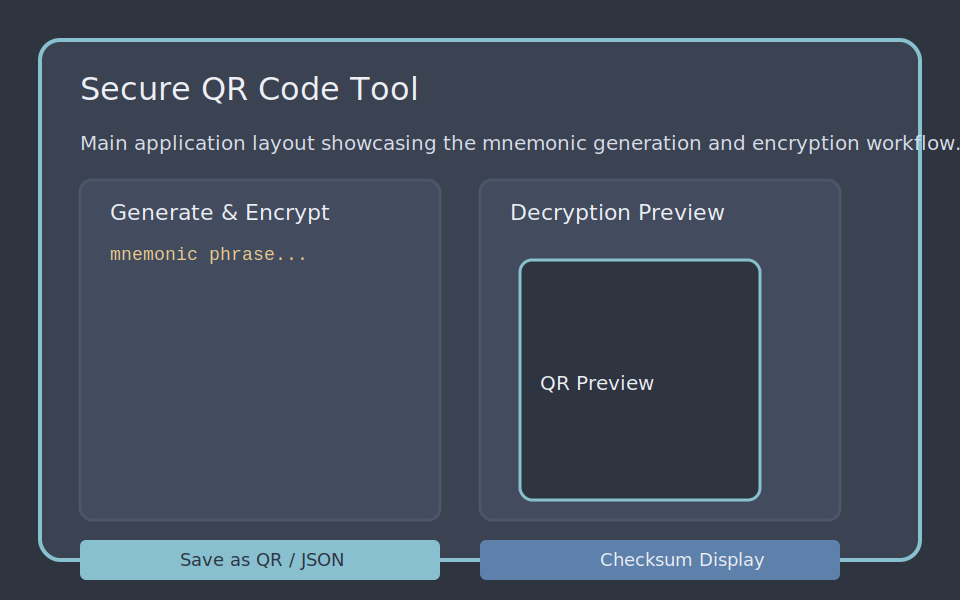

# Secure QR Code Tool

A refactored and fully tested version of the Secure QR Code Tool. The desktop
application allows you to generate BIP-39 compatible mnemonic phrases, encrypt
them with AES-256-GCM and store the ciphertext as JSON or a QR code. The
project separates the core cryptographic components from the GUI so that the
security-critical code can be audited and unit tested independently.

## Features

- **Strong encryption** – AES-256-GCM with PBKDF2-HMAC key derivation and a
  configurable work factor.
- **Mnemonic workflow** – generates 24-word recovery phrases using the
  `mnemonic` library and exposes checksum helpers.
- **QR interoperability** – save encrypted payloads as QR code images when
  `segno` is installed, or import payloads from existing QR images.
- **Modular architecture** – the package exposes reusable components for
  encryption, mnemonic handling and QR management. The GUI lives in
  `secure_qr_tool.app` and imports the core modules lazily, allowing automated
  tests to run without a graphical environment.

## Project layout

```
├── docs/
│   └── screenshots/
│       └── ui_overview.svg
├── src/
│   └── secure_qr_tool/
│       ├── app.py
│       ├── config.py
│       ├── icon.py
│       ├── network.py
│       ├── qr.py
│       ├── security.py
│       ├── state.py
│       └── __main__.py
└── tests/
    └── test_security.py
```

## Running the GUI

Install the mandatory dependencies plus the `ui` optional extras and launch the
application via the console script:

```bash
pip install .[ui]
secure-qr-tool
```

On environments without a GUI you can still leverage the encryption helpers by
importing the package in your own scripts.

## Cryptographic specification

The cryptographic architecture, including the PBKDF2 parameters, AES-256-GCM
usage and QR payload hashing strategy, is documented in
[`docs/cryptography.md`](docs/cryptography.md). For an implementation-agnostic
description of the encryption and decryption protocol, including payload
serialization rules, refer to [`docs/encryption_protocol.md`](docs/encryption_protocol.md).

## Tests

The automated checks live under [`tests/`](tests/) and are executed with
[`pytest`](https://docs.pytest.org/). Run the complete suite with:

```bash
pytest
```

The test modules contain small, focused examples that illustrate how the core
APIs are meant to be used:

- **`tests/test_qr.py`**
  - `test_payload_digest_matches_sha256` instantiates
    [`QRCodeManager`](src/secure_qr_tool/qr.py) and verifies that calling
    `payload_digest` twice with the same JSON payload returns the same
    SHA-256 hex digest. The assertion also checks that the digest has the
    expected 64 hexadecimal characters (256 bits). You can experiment with the
    helper interactively by running `python -m secure_qr_tool.qr` in a REPL and
    calling `QRCodeManager().payload_digest('{"salt": "abc"}')`.
  - `test_save_png_returns_digest` uses `monkeypatch` to replace the optional
    [`segno`](https://segno.readthedocs.io/) dependency with a dummy QR object.
    It asserts that `save_png` still returns the digest when the QR code writer
    is mocked, demonstrating how to test code paths that depend on external
    libraries.
- **`tests/test_security.py`**
  - `test_secure_string_clears_buffer` constructs a [`SecureString`](src/secure_qr_tool/security.py)
    to show how secrets can be wiped from memory by calling `.clear()`.
  - `test_encrypt_roundtrip` encrypts a mnemonic using [`CryptoManager`](src/secure_qr_tool/security.py),
    confirms that the payload contains the `salt`, `nonce`, `ciphertext`, and
    `version` fields, and then decrypts the payload to prove that the original
    text is recovered.
  - `test_decrypt_rejects_invalid_payload` demonstrates the validation logic by
    passing an incomplete payload to `decrypt` and asserting that a `ValueError`
    is raised.
  - `test_mnemonic_checksum_length` and `test_mnemonic_word_counts` use
    [`MnemonicManager`](src/secure_qr_tool/security.py) to generate recovery
    phrases. They show how to request the default number of words, validate the
    phrase, compute its checksum (six characters), and iterate through all
    supported BIP-39 word counts.
  - `test_invalid_mnemonic_word_count_raises` provides an example of the guard
    rails around unsupported word counts by asserting that requesting 15 words
    raises a `ValueError`.

These examples double as living documentation—reading the tests gives you
concrete usage patterns for the cryptographic and QR helpers while ensuring
regressions are caught automatically.

## Screenshot



## How it works

1. The user sets an in-memory master password on the lock screen. The password
   is wrapped in `SecureString`, a bytearray-backed helper that wipes memory
   once it falls out of scope.
2. Generating a mnemonic triggers the `MnemonicManager`, creating a new 24-word
   phrase and displaying a checksum to validate manual backups.
3. Encryption is executed in a worker thread using `CryptoManager`. The worker
   serialises the salt, nonce and ciphertext (all base64 encoded) so that the
   result can be persisted as JSON or encoded as a QR code.
4. Decrypting an existing payload reverses the process, presenting the
   recovered mnemonic alongside its checksum for manual verification.

The refactor introduces strict separation between the UI layer and the core
logic, making the security-sensitive portions easy to unit test and audit.
